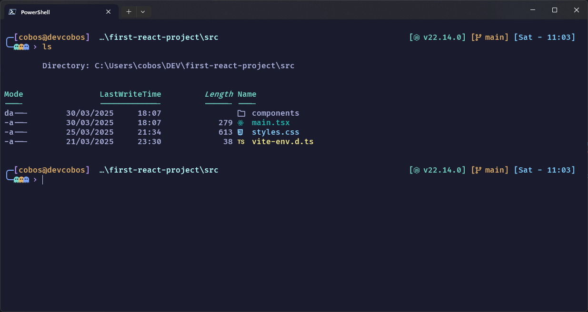
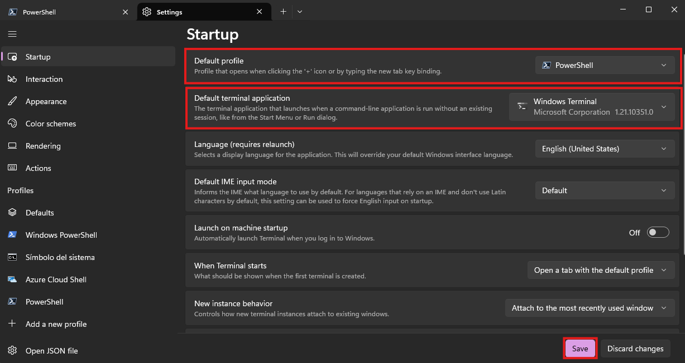
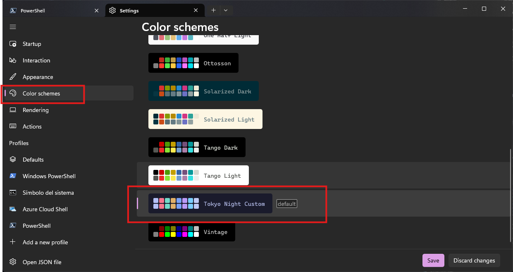
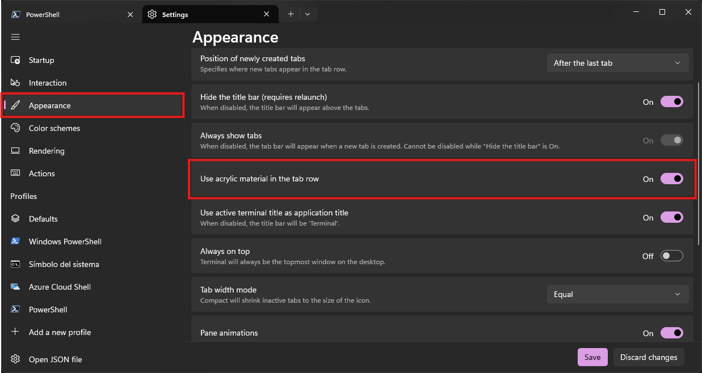
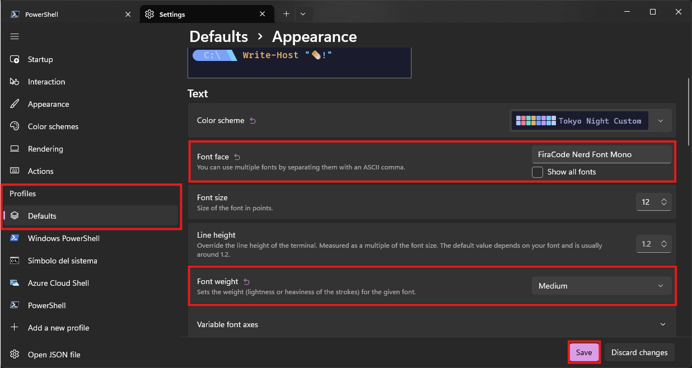
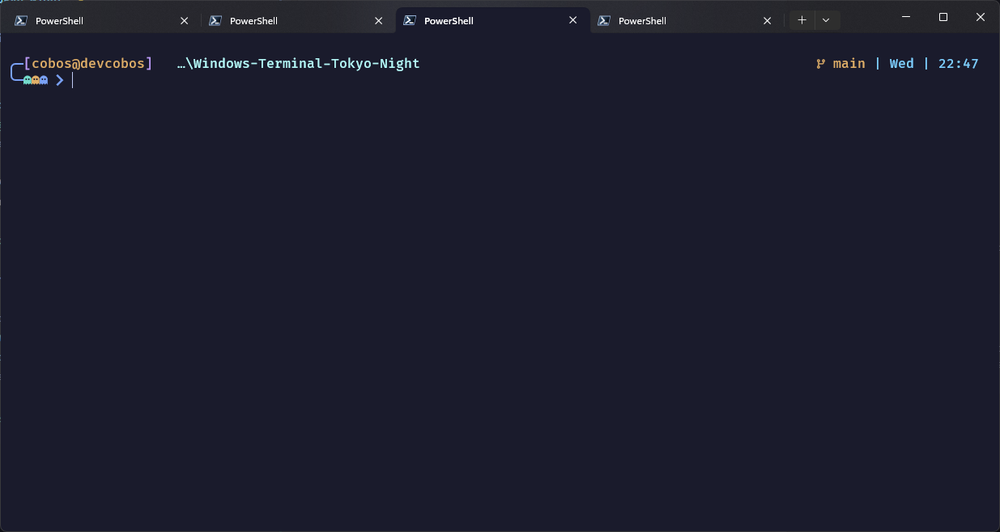
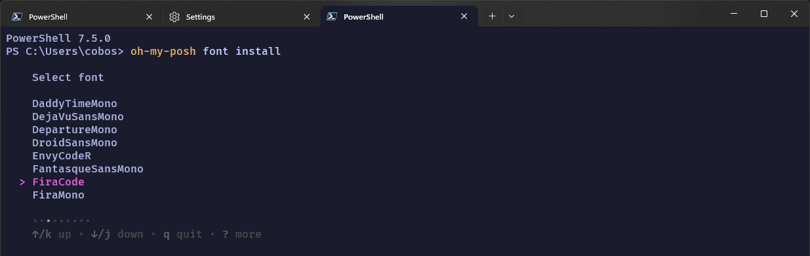
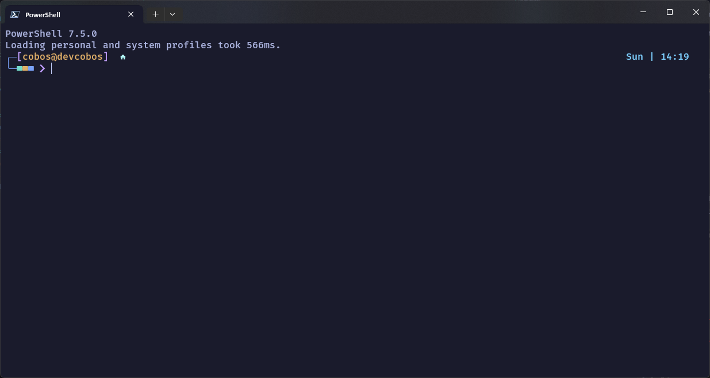

# Windows Terminal Tokyo Night 🌙

This repository contains a custom **Windows Terminal** theme and a personalized prompt configuration. You can choose to use either **Starship** or **Oh My Posh**  to bring the Tokyo Night aesthetic to your shell.



## Table of Contents

- [Initial Setup](#initial-setup)
- [Installation Tokyo Night Theme](#installation-tokyo-night-theme)
- [Install Starship](#install-starship)
- [Install Oh My Posh](#install-oh-my-posh)

## Initial Setup

1. **Install Windows Terminal**  
   Download and install **Windows Terminal** from the Microsoft Store:  
    [Windows Terminal - Microsoft Store](https://apps.microsoft.com/detail/9N0DX20HK701?hl=en-us&gl=ES&ocid=pdpshare)
2. **Install PowerShell**  
   Download and install the latest version of **PowerShell** from the Microsoft Store:  
    [PowerShell - Microsoft Store](https://apps.microsoft.com/detail/9MZ1SNWT0N5D?hl=en-us&gl=ES&ocid=pdpshare)
3. **Set Windows Terminal as default**

   1. Open **Windows Terminal**.
   2. Go to **Settings**.
   3. Set **Windows Terminal** and **PowerShell** as the default options on startup.
   4. Save the changes.

   

## Installation Tokyo Night Theme

1. Download this repository.
2. Navigate to the `Windows Terminal Theme` folder.
3. Run the `install.ps1` script.
4. Once installed, restart your terminal.
5. Open the settings, go to **Color Schemes**, and select **Tokyo Night Custom**.
   
6. Set it as the default color scheme.
7. Save the changes.
   

### Change Tab Row (Optional)

1. Open the settings and go to **Appearance**.
2. Locate the option **Use Acrylic Material in the tab row**.
3. Save the changes.
   

## Install Starship

[Official Documentation](https://starship.rs/guide/)

### Using winget to install

```
winget install --id Starship.Starship
```

### Install a Compatible Font

You need a Nerd Font installed and enabled in your terminal to display icons and special symbols. 

1. Download a `FiraCode Nerd Font` font from:  [Nerd Fonts - Font Downloads](https://www.nerdfonts.com/font-downloads)
2. Install the font and open the terminal.
3. Go to `Settings → Profiles → Defaults → Appearance`.
4. Select the font **FiraCode Nerd Font Mono** and set the thickness to **Medium**.
5. Save the changes.
   

### Configure your shell to use Oh My Posh custom prompt

1. Download this repository.
2. Navigate to the `Starship` folder.
3. Run the `install.ps1` script.
4. Once installed, restart your terminal.
   

## Install Oh My Posh

[Official Documentation](https://ohmyposh.dev/docs/installation/windows)

### Using winget to install

```
winget install JanDeDobbeleer.OhMyPosh -s winget
```

> **Note:** It's recommended to restart the terminal to reload the PATH. If the `oh-my-posh` command isn't recognized, you can either re-run the installer or add it manually to your PATH:
>
> ```
> $env:Path += ";C:\Users\<your_user>\AppData\Local\Programs\oh-my-posh\bin"
> ```

### Install a compatible font

1. Run the following command in PowerShell:
   ```
   oh-my-posh font install
   ```
2. Select the `FiraCode` font.
   
3. Restart the terminal.
4. Go to `Settings → Profiles → Defaults → Appearance`.
5. Select the font **FiraCode Nerd Font Mono** and set the thickness to **Medium**.
6. Save the changes.
   

### Configure your shell to use Oh My Posh custom prompt

1. Download this repository.
2. Navigate to the `Oh My Posh` folder.
3. Run the `install.ps1` script.
4. Once installed, restart your terminal.

   
